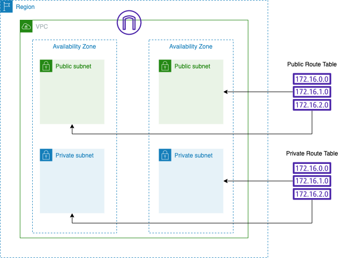
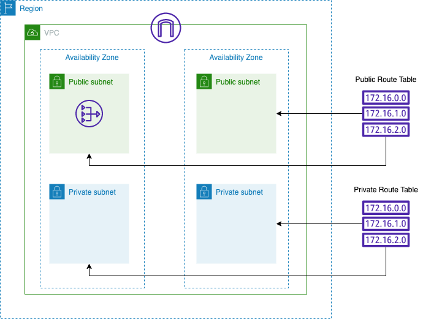

# よくある基本ネットワーク構成

VPCを作成しIGWをアタッチしPublicSubnetとPrivateSubnetを2つず作成する…といったよくあるパターンをテンプレート化したものです

## Parameters

- ProjectName
    - 作成されたリソースはPrefixとして指定したプロジェクト名が付きます
- VPCCIDR
    - 10.0.0.0/16のように指定します。各種サブネットのCIDRは指定されたCIDRから自動で計算され、下記ネットワーク空間を作成します
    - Public Subnet->/24
    - Private Subnet->/23

## Exports

`${指定したプロジェクト名}-${各種リソース名}`でエクスポートされます。クロススタックでImportする際に参照してください

---

CFnテンプレート:base-network.yaml

### 👆+NATGatewayを加えたもの

CFnテンプレート:base-natgateway.yaml(クロススタック参照のためbase-networkのStack名が必要です)

